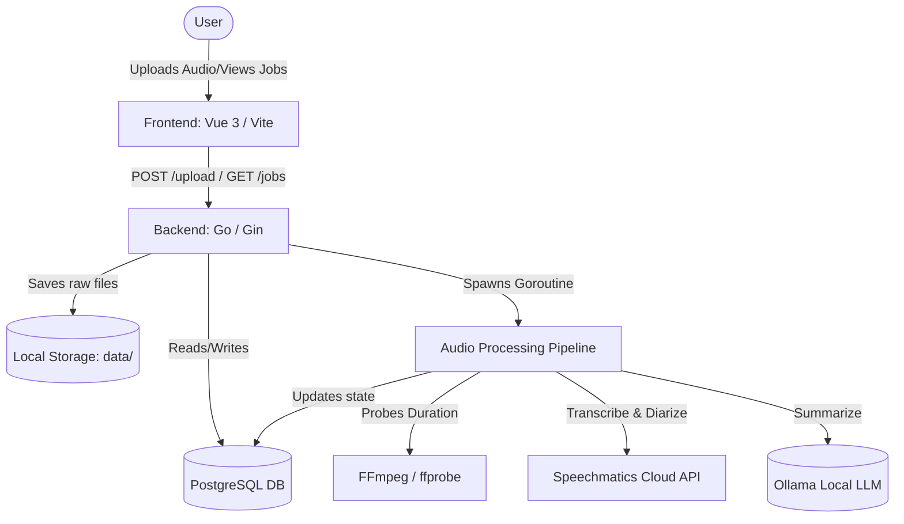

# Technical Specification

This document details the system architecture, file structure, and technical components of the **Note-Taker AI** application.

---

## 🏗️ Architecture Overview

The system uses a decoupled, three-tier architecture:

1. **Frontend**: A modern, single-page application built with **Vue 3** and **Vite**. It handles audio uploads, polls the API for job updates, and renders the interactive job lists.
2. **Backend**: A **Go** web server using the **Gin** framework. It exposes RESTful API endpoints for user authentication, settings configuration, file uploads, and retrieving recordings. It manages asynchronous background goroutines for audio processing.
3. **Database**: **PostgreSQL** is utilized via **GORM** to store user information, app settings, recording metadata, and transcript segments.
4. **AI Pipeline**:
   - **Speechmatics API**: Cloud-based service for speech-to-text transcription and integrated speaker diarization.
   - **Ollama**: Local LLM endpoint for meeting summarization and action item generation.



---

## 📂 Codebase Structure

```text
/note-taker
├── SETUP.md                     # Dependencies and environment setup
├── RUNNING_LOCALLY.md           # How to spin up the servers
├── TECHNICAL_SPECIFICATION.md   # System design and specifications (this file)
├── /backend
│   ├── main.go                  # API Entry point and CORS middleware
│   ├── go.mod                   # Go module configuration
│   ├── go.sum                   # Go dependencies checksum
│   ├── /api
│   │   ├── auth.go              # User registration and login handlers
│   │   ├── users.go             # User profile handlers
│   │   ├── settings.go          # System settings handlers
│   │   └── recordings.go        # Upload, listing, updates, delete, and download routes
│   ├── /models
│   │   ├── database.go          # PostgreSQL connection initialization and seeding
│   │   ├── schema.go            # GORM database schemas (User, Recording, Segment, Settings)
│   │   └── jobs.go              # Custom jobs structures and statuses
│   └── /services
│       ├── audio_service.go     # Audio processing orchestration
│       ├── speechmatics_service.go # Speechmatics transcription API integration
│       └── ai_service.go        # Ollama summary generation integration
└── /frontend
    ├── package.json             # NPM dependencies and scripts
    ├── vite.config.js           # Vite server configuration
    ├── index.html               # Main entry HTML
    └── /src
        ├── main.js              # Vue app initializer
        ├── App.vue              # Dashboard and upload layout
        ├── style.css            # Vanilla CSS design tokens & layouts
        └── /components
            └── JobCard.vue      # Individual meeting job status card
```

---

## 🔌 API Endpoints

The backend exposes APIs under the prefix `/api`:

### 🔐 Authentication (`/api/auth`)
- `POST /api/auth/register`: Register a new user.
- `POST /api/auth/login`: Authenticate and receive a JWT.

### 🎙️ Recordings (`/api/recordings`)
All routes require JWT authentication except where noted:
- **`POST /api/recordings`**: Uploads an audio file and triggers the transcription pipeline.
- **`GET /api/recordings`**: Retrieves all recordings for the authenticated user.
- **`GET /api/recordings/recent`**: Retrieves the most recent recordings.
- **`GET /api/recordings/:recording_id`**: Retrieves detailed info, transcript segments, and the summary for a specific recording.
- **`DELETE /api/recordings/:recording_id`**: Deletes a recording.
- **`POST /api/recordings/:recording_id/summarize`**: Manually triggers AI summary generation.
- **`GET /api/recordings/share/:recording_id`**: (Public) Retrieves a shared recording without authentication.

### ⚙️ Settings (`/api/settings`)
- **`GET /api/settings`**: Retrieves application settings (e.g. Speechmatics API Key, selected Ollama model).
- **`PUT /api/settings`**: Updates application settings.

---

## ⚙️ Processing Workflow

The core audio processing orchestrator is located in [audio_service.go](file:///Users/raenard/Documents/note-taker/backend/services/audio_service.go):

1. **Pre-processing (FFmpeg)**: Uses `ffprobe` to determine and record the duration of the audio.
2. **Transcription & Diarization (Speechmatics)**: Sends the audio file to the Speechmatics Cloud API with diarization enabled (implemented in [speechmatics_service.go](file:///Users/raenard/Documents/note-taker/backend/services/speechmatics_service.go)). Polls the API until the job status is finished, then retrieves and parses the JSON transcript into speaker-separated segments.
3. **Summarization (Ollama)**: Passes the final diarized transcript segments to the local Ollama LLM endpoint to generate a meeting title, executive summary, and action items (implemented in [ai_service.go](file:///Users/raenard/Documents/note-taker/backend/services/ai_service.go)).
4. **Persistence**: Saves and updates all intermediate states (pending ➡️ processing ➡️ completed/error) and results directly to PostgreSQL.
